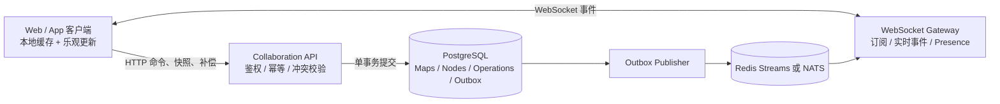

# 长期协作底座设计与实施清单

> 状态：实施中（P1–P10 核心已落地；跨实例总线可选 PostgreSQL LISTEN/NOTIFY 或 Redis Streams，文档权威仍是 PostgreSQL）  
> 适用项目：`mind-map`  
> 目标：把当前“小图 Yjs、大图 HTTP”的双一致性模型，逐步升级为统一、可恢复、可审计、可横向扩展的长期协作底座。

## 一、最终目标

> **这一节是整套产品的完成定义，不是 P1–P9 的勾选清单。** P1–P9 的落地情况在「十四、分阶段实施计划」。下面只勾已经真正成立的条目；没勾的是还没做完，不是文档忘了更新。

- [x] 所有思维导图使用同一套协作语义，节点数量只影响加载和渲染策略。
- [x] PostgreSQL 是权威数据源，客户端和 WebSocket 服务都不是最终真相来源。
- [x] 每个房间拥有严格递增的 `version bigint`，不再使用 `updated_at` 判断协作版本。
- [x] 所有增删改移动都表示为明确的操作，不再通过上传整棵树推断变化。
- [x] WebSocket 用于低延迟事件通知，HTTP 用于命令提交、快照、补偿和懒加载。
- [x] WebSocket 消息丢失或客户端离线后，可以从操作日志精确补齐。
- [x] 支持大图懒加载，同时保证未加载分支不会永久漏掉变化。
- [ ] 支持幂等提交、多人冲突处理、用户级撤销、历史审计和故障恢复。
- [ ] 支持多实例部署，不依赖单个 Node.js 进程内存状态。

同进程内的 live Y.Doc 只是 PostgreSQL 提交后的写穿缓存：刷新、预览和 HTTP 命令都以库里的 `room_nodes` / `rooms.nodes` 为准。Presence 已支持 Redis TTL（30s）+ `clientId` 多标签页区分，无 Redis 时回退进程内存。幂等、冲突、用户撤销、重做和审计已有（P2/P8/P10）；管理端归档与完整恢复台仍缺，所以第一条仍保持未完成。

房间内「导入并替换当前导图」必须走 `POST /api/files/:id/replace`（`map.replace`），不能只改画布再靠本地 `storeData`（协同会话会跳过持久化）。2026-09-01 已补上前端这条写路径。

## 二、核心设计原则

1. **版本号是可靠性基础**：每个成功事务只产生一个连续版本。
2. **操作日志是恢复基础**：客户端可以通过 `afterVersion` 补齐缺失事件。
3. **WebSocket 只是加速器**：通知丢失不能造成永久数据不一致。
4. **加载策略不改变协作语义**：100 个节点和 10 万个节点使用相同操作协议。
5. **服务端权威裁决结构冲突**：移动、删除、排序和防环必须在服务端校验。
6. **命令必须幂等**：客户端重试同一个 `operationId` 不得重复修改数据。
7. **撤销也是新操作**：不能用客户端旧快照覆盖其他协作者的修改。
8. **在线状态与文档事件分离**：presence 是瞬时状态，operations 是可靠数据。

## 三、目标整体架构




### 组件职责

#### 客户端

- 保存 `lastAppliedVersion`、已加载节点和待确认的本地操作。
- 对操作执行乐观更新，并在服务端拒绝时回滚对应操作。
- 严格按版本顺序应用服务端事件。
- 发现版本缺口时暂停实时应用，先通过 HTTP 补偿。
- 未加载分支只记录 dirty/version，展开时再获取最新子树。

#### Collaboration API

- 处理鉴权、权限、参数校验、幂等和房间级串行事务。
- 将客户端命令转换为权威事件。
- 同一事务内更新节点、递增房间版本、写操作日志和 outbox。
- 处理结构冲突、防环、父节点删除和 SOP 保护规则。

#### WebSocket Gateway

- 订阅房间事件并低延迟推送给客户端。
- 接受客户端 `subscribe(mapId, afterVersion)`。
- 只负责连接和分发，不直接成为文档权威状态。
- presence 使用独立频道和 TTL，不混入可靠操作日志。

#### PostgreSQL

- 保存规范化节点、房间版本、操作日志和待发布事件。
- 保证每个房间的操作顺序和事务原子性。
- 支持快照、历史审计、补偿查询和恢复。

#### Redis Streams / NATS

- 将已提交事件分发给多个 WebSocket 实例。
- 不替代 PostgreSQL 操作日志。
- 第一阶段可以暂不引入，单实例稳定后再接入。

## 四、目标数据模型

### `maps`

```sql
create table maps (
  id text primary key,
  title text not null,
  version bigint not null default 0,
  root_node_id text,
  created_by text,
  created_at timestamptz not null default now(),
  updated_at timestamptz not null default now()
);
```

### `nodes`

```sql
create table nodes (
  map_id text not null references maps(id),
  id text not null,
  parent_id text,
  position text not null,
  data jsonb not null default '{}'::jsonb,
  node_version bigint not null default 0,
  deleted_at timestamptz,
  created_at timestamptz not null default now(),
  updated_at timestamptz not null default now(),
  primary key (map_id, id)
);

create index nodes_parent_position_idx
  on nodes(map_id, parent_id, position)
  where deleted_at is null;
```

### `operations`

```sql
create table operations (
  map_id text not null references maps(id),
  version bigint not null,
  operation_id uuid not null,
  actor_id text not null,
  client_id text,
  operation_type text not null,
  payload jsonb not null,
  event jsonb not null,
  inverse_payload jsonb,
  created_at timestamptz not null default now(),
  primary key (map_id, version),
  unique (map_id, operation_id)
);
```

### `outbox`

```sql
create table outbox (
  id bigserial primary key,
  map_id text not null,
  version bigint not null,
  event jsonb not null,
  created_at timestamptz not null default now(),
  published_at timestamptz,
  unique (map_id, version)
);
```

### 数据约束待办

- [ ] 为每个节点保留稳定 UID，禁止复用已删除节点 UID。
- [x] 明确根节点约束：每个房间只能有一个有效根节点。
- [ ] 防止节点把自己或自己的后代设为父节点。
- [ ] 明确软删除保留周期和永久清理策略。
- [ ] 为 `operations` 制定保留、归档和快照压缩策略。
- [ ] 确认 `data jsonb` 中哪些字段需要拆成独立列或字段版本。

## 五、统一操作协议

### 客户端命令格式

```json
{
  "operationId": "55d33c1d-a8ed-4e10-8ed0-c028dd21421f",
  "mapId": "room-123",
  "actorId": "user-456",
  "clientId": "browser-tab-789",
  "baseVersion": 1082,
  "type": "node.insert",
  "payload": {
    "uid": "node-new",
    "parentUid": "node-parent",
    "position": "aM",
    "data": {
      "text": "新节点"
    }
  }
}
```

### 第一批操作类型

- [x] `node.insert`
- [x] `node.update`
- [x] `node.move`
- [x] `node.delete`
- [x] `node.restore`
- [ ] `node.reorder`
- [x] `map.update`
- [x] `batch.apply`
- [x] `operation.undo`
- [x] `operation.redo`

### 服务端事件格式

```json
{
  "mapId": "room-123",
  "version": 1083,
  "operationId": "55d33c1d-a8ed-4e10-8ed0-c028dd21421f",
  "actorId": "user-456",
  "type": "node.inserted",
  "payload": {
    "uid": "node-new",
    "parentUid": "node-parent",
    "position": "aM",
    "data": {
      "text": "新节点"
    }
  },
  "affectedUids": ["node-new", "node-parent"]
}
```

### 服务端提交事务

- [x] 根据 `(map_id, operation_id)` 检查是否已处理。
- [x] 使用数据库事务锁定对应 `maps` 行。
- [x] 读取当前 `maps.version`，执行权限和冲突校验。
- [ ] 修改 `nodes`。
- [x] 将 `maps.version` 增加 1。
- [x] 写入 `operations`，包括权威事件和逆向操作数据。
- [x] 写入相同版本的 `outbox`。
- [x] 提交事务后再进行消息发布。
- [x] 重复提交返回第一次的结果，不重复产生版本。

## 六、客户端同步状态机

```text
BOOTSTRAP
  └─ 获取快照和 snapshotVersion

CONNECTING
  └─ WebSocket subscribe(afterVersion)

LIVE
  ├─ 收到 version = last + 1：直接应用
  ├─ 收到 version <= last：忽略重复事件
  └─ 收到 version > last + 1：进入 RECOVERING

RECOVERING
  ├─ GET /operations?after=last
  ├─ 顺序补齐事件
  └─ 补齐后返回 LIVE

RESNAPSHOT
  └─ 日志已归档或差距过大时重新加载快照
```

### 客户端实现待办

- [ ] 增加统一 `collaborationStore`，保存连接和版本状态。
- [x] 保存 `lastAppliedVersion`。
- [ ] 保存 `pendingOperations`，以 `operationId` 为键。
- [ ] 将画布命令转换成协议操作，不再直接上传完整树。
- [ ] 实现乐观更新确认、拒绝回滚和超时重试。
- [ ] 实现严格顺序事件缓冲区。
- [x] 实现缺口检测和 HTTP 补偿。
- [x] 实现重复事件去重。
- [x] 实现快照过期后的无损重载。
- [x] 编辑中的文本节点收到远端更新时避免打断输入。

## 七、大图懒加载

### 快照接口

```http
GET /api/maps/{mapId}/snapshot?depth=2
```

响应必须包含：

- 当前 `version`
- 根节点和指定深度节点
- 每个返回节点的 `childCount`
- 子树版本或最后影响版本
- 是否截断及继续加载信息

### 子树接口

```http
GET /api/maps/{mapId}/subtrees/{uid}?depth=2&knownVersion=91
```

### 懒加载待办

- [x] 客户端维护 `loadedUids`。
- [x] 客户端维护 `dirtySubtrees: uid -> version`。
- [x] 远端事件影响未加载节点时，只标记对应祖先分支 dirty。
- [x] 展开节点时获取最新子树，并以服务端版本合并。
- [x] 删除未加载子树时更新父节点 `childCount`。
- [x] 移动节点跨越已加载和未加载分支时正确刷新两侧父节点。
- [x] 搜索和定位接口返回祖先链，客户端按链逐层加载。
- [x] 导出走服务端完整快照，不依赖客户端已加载范围。

## 八、冲突处理规则

### 结构冲突

- [x] 插入时父节点不存在：返回明确错误，不静默丢失。
- [ ] 父节点已删除：根据产品规则选择拒绝或挂到最近有效祖先。
- [x] 移动形成环：服务端拒绝。
- [x] 两人同时移动同一节点：按服务端提交顺序生效并保留历史。
- [ ] 删除与移动同时发生：删除优先，移动返回冲突。
- [ ] 删除与编辑同时发生：删除优先，编辑进入可恢复的失败状态。
- [x] SOP 等受保护节点继续在服务端进行权限确认。

### 属性冲突

- [ ] 普通字段采用字段级版本或明确的最后写入生效规则。
- [x] 事件中携带被修改的字段，不用整份 `data` 覆盖其他字段（`node.updated` 含 `changedFields`）。
- [ ] 图片、标签、备注、样式分别定义合并策略。
- [ ] 确定富文本是否需要节点级 CRDT。

### 文本协作建议

- [x] 第一阶段使用节点文本提交操作，编辑完成或节流后提交。
- [ ] 如果确实需要逐字符共同编辑，为单个活跃节点建立小型 Y.Doc。
- [x] 树结构、移动、删除和排序始终走服务端操作日志。
- [x] 禁止再让整个大型思维导图共享一个无限增长的 Y.Doc。

## 九、节点排序策略

- [x] 使用 Fractional Indexing、LexoRank 或等价位置键替代数组下标。
- [x] 同位置并发插入时使用 `position + actorId/operationId` 稳定排序。
- [x] 服务端返回最终权威 `position`。
- [x] 客户端不能自行假设服务器接受了原位置。
- [x] 位置键过长时后台执行 `reindex`，并广播批量重排事件。
- [x] 为批量重排设计不阻塞普通编辑的策略。

## 十、撤销与重做

- [x] 每个可撤销操作保存 `inverse_payload`。
- [x] 撤销只针对当前用户自己的已提交操作。
- [x] 撤销通过提交新操作完成，不能恢复整棵旧树。
- [x] 被后续操作影响时，服务端判断逆向操作是否仍可安全执行。
- [x] 无法直接撤销时返回冲突原因和可选恢复方案。
- [x] 客户端撤销栈保存 `operationId`，不保存全量树 JSON。

## 十一、Presence 与实时事件

### Presence

- [x] 独立频道：`presence:{mapId}`（HTTP `/api/files/:id/presence` + Redis key 前缀；Yjs `{mapId}__presence` 仍用于 documentChange）。
- [x] 使用 `clientId` 区分同一用户的不同标签页和设备。
- [ ] 状态包含用户、光标、选中节点和编辑节点。
- [x] Redis TTL 建议 30 秒，客户端每 10 秒续期。
- [x] 离线状态不写入操作日志。

### 文档事件

- [ ] 独立频道：`events:{mapId}`。
- [x] 所有事件必须包含连续 `version`。
- [x] WebSocket 只广播数据库已提交事件。
- [x] 客户端不得将 awareness 消息视为可靠文档事件。
- [x] 广播失败由 outbox 重试，不影响数据库事务结果。

## 十二、多实例和可靠发布

- [x] 引入 Transactional Outbox。
- [x] 实现 outbox 后台发布器。
- [x] 为 outbox 记录重试次数、错误和发布时间。
- [x] 引入 Redis Streams 或 NATS 作为跨实例事件总线。
- [x] WebSocket 实例按房间订阅总线事件。
- [x] 发布器和消费者都必须支持重复消息。
- [x] 验证 API 实例重启不会丢失已提交事件。
- [ ] 验证 WebSocket 实例扩缩容不会打乱房间版本顺序。
- [x] 为失败 outbox 提供监控和人工重放工具。

## 十三、建议 API

```text
POST   /api/maps/{mapId}/operations
POST   /api/maps/{mapId}/operations/batch
POST   /api/maps/{mapId}/operations/{operationId}/undo

GET    /api/maps/{mapId}/snapshot
GET    /api/maps/{mapId}/operations?after={version}
GET    /api/maps/{mapId}/nodes?uids={uids}
GET    /api/maps/{mapId}/subtrees/{uid}
GET    /api/maps/{mapId}/locate/{uid}
GET    /api/maps/{mapId}/version

WS     /collaboration
```

### WebSocket 消息

```json
{
  "type": "subscribe",
  "mapId": "room-123",
  "afterVersion": 1083
}
```

```json
{
  "type": "event",
  "mapId": "room-123",
  "version": 1084,
  "event": {}
}
```

```json
{
  "type": "resnapshot_required",
  "mapId": "room-123",
  "currentVersion": 9000
}
```

## 十四、分阶段实施计划

### P0：固定现状和建立基线

- [x] 为当前小图 Yjs 和大图 HTTP 流程补充架构说明。
- [x] 记录当前 100、1,000、10,000 节点的加载和编辑指标。
- [x] 增加双客户端浏览器端到端协作测试。
- [x] 增加断网、重连、重复请求和服务重启测试。
- [x] 确认当前 PostgreSQL 数据备份和恢复流程。

验收标准：现有行为有自动化测试保护，后续迁移可以判断是否回归。

#### 当前实现（2026-09）

权威节点数据是 PostgreSQL `room_nodes`。`rooms.nodes` JSON 仍双写，作为派生快照和回退；`rooms.version` 与 `room_operations` 继续作为版本和操作日志。可用 `COLLAB_NODES_AUTHORITY=json` 回退到 JSON 权威。

协作写协议已统一为 HTTP 操作日志 + `room_nodes`。`LARGE_MAP_AT`（200）只决定预览是否折叠/懒加载，不再切换一致性模型。`http_collab` 对任意房间为 true。WebSocket 仅用于 presence 与 `documentChange` 通知。

| 规模 | 写路径 | 版本 / 操作日志 | 实时通道 | 加载 |
|---|---|---|---|---|
| 任意房间 | HTTP 节点/操作 API：临时 Y.Doc 上应用，提交数据库后再合并 live | 每次成功事务 `version+1` 并写入 `room_operations` | awareness 通知；缺口用 `GET /operations?after=` 补偿 | <200 全量预览；≥200 折叠深度，按需拉子树 |

服务端仍接受直连房间名的整图 Yjs（旧测试与兼容），协作客户端打开房间时不再走这条写路径。小图文本与结构都经 HTTP 节流提交；本阶段不引入节点级 Y.Doc。

P1–P3 自动化验收（`npm run test:collab:operations`，需本机 collab `http://127.0.0.1:1234`）：

- 连续 1,000 次插入，版本从 0 严格到 1000，`/operations` 分页无重复、无倒退。
- 同一 `operationId` 重复 10 次只产生 version=1。
- 两个内存副本随机丢弃约 10% 通知后，按 `lastAppliedVersion` 暂停乱序应用，再 `GET /operations?after=` 顺序补齐，结构与服务端一致。

双浏览器 Chromium E2E 仍未覆盖；已有两个真实 WebSocket 会话模拟两个标签页：一方 HTTP 写入并通过 awareness `documentChange` 通知，另一方按版本补偿，断线重连后仍收敛。重复 `operationId` 已覆盖。服务进程重启由 `npm run test:collab:restart` 覆盖：写入后杀掉 `collabServer` 再拉起，版本、快照和 `room_nodes` 一致性检查仍成立。

#### 预览指标基线（本机 `buildPreview`，2026-09-01）

仅测量服务端从对象图生成预览树的 CPU 时间，不含网络、浏览器渲染和首次打开整页：


| 节点数    | `buildPreview` |
| ------ | -------------- |
| 100    | 0.45ms         |
| 1,000  | 1.79ms         |
| 10,000 | 3.06ms         |


10,000 节点预览会走折叠/裁剪（`keepDepth=2`），不把整图交给客户端。完整加载/编辑 P95 仍待浏览器侧补测。

#### PostgreSQL 备份与恢复

Docker Compose 中的 Postgres 数据卷为 `mind-map-pg`，主机端口 `127.0.0.1:${PGPORT:-15432}`，库名默认 `mind_map`，用户默认 `postgres`。

备份（容器内）：

```bash
docker compose exec postgres pg_dump -U postgres -d mind_map > mind_map_backup.sql
```

从主机连接时使用 `127.0.0.1:15432`。恢复前应停止写入（停 app / 本机 `collabServer`），避免本地 collab 与 Docker 共用同一库时两边同时改数据。恢复示例：

```bash
docker compose exec -T postgres psql -U postgres -d mind_map < mind_map_backup.sql
```

本机调试用的 `node ./bin/collabServer.js` 与 Docker Postgres 共用该库；跑完集成测试后应关掉本机 1234 端口进程，避免和容器内服务抢同一份 `rooms` 数据。

### P1：引入房间单调版本号

- [x] 为 `rooms/maps` 增加 `version bigint not null default 0`。
- [x] 所有节点修改在事务内递增版本。
- [x] API 响应和 WebSocket 通知返回 `version`。
- [x] 客户端保存 `lastAppliedVersion`。
- [x] 保留当前 `updated_at`，但停止将其用于一致性判断。

验收标准：连续快速执行 1,000 次操作，版本严格从 N 增长到 N+1000，无重复、无倒退。

### P2：建立操作日志和幂等命令

- [x] 创建 `operations` 表。
- [x] 实现 `operationId` 幂等。
- [x] 将新增、修改、移动、删除转换成统一操作协议。
- [x] 操作日志记录 actor、payload、event 和 inverse payload。
- [x] 旧 HTTP 节点接口内部适配到新操作服务，避免立即改完所有前端。

验收标准：同一请求重复 10 次只产生一次数据修改和一个版本。

### P3：可靠断线补偿

- [x] 实现 `/operations?after=`。
- [x] 客户端检测版本缺口。
- [x] 缺口发生时暂停后续事件并顺序补齐。
- [x] 操作日志不可用或差距过大时要求重新加载快照。
- [x] 删除大图模式对 `save-status.updated_at` 的同步依赖。

验收标准：随机丢弃 10% WebSocket 消息后，两个客户端仍最终收敛到相同版本和结构。

### P4：规范化节点存储

- [x] 创建 `nodes` 表和索引。
- [x] 编写旧 `rooms.nodes` JSON 到规范化表的迁移程序。
- [x] 迁移过程支持校验节点数、根节点、父子关系和环。
- [x] 读取接口优先使用 `nodes` 表。
- [x] 保留旧快照双写一段观察期。
- [x] 通过校验后停止旧 JSON 作为权威数据源。

验收标准：迁移前后导出的完整树结构和节点数据一致。

当前表名随现有 schema：`room_nodes(room_key, uid)`，尚未改名为目标文档中的 `maps` / `nodes`。`position` 已改为 16 位 base36 位置键（P9）；旧的 8 位零填充下标在下次写入该兄弟列表时重排迁移。提交时先规范化并写入 `room_nodes`，再把同一份树写入 `rooms.nodes` 作为派生快照。读路径在表版本不低于房间版本且结构合法时以表为准。`GET /api/maps/{id}/consistency` 比较 JSON 与表。回退：`COLLAB_NODES_AUTHORITY=json`、`COLLAB_NODES_DUAL_WRITE=0`、`COLLAB_NODES_READ=0`。小图 Yjs 保存仍会双写快照，但不走操作日志。

### P5：统一小图和大图协作语义

- [x] 小图也改用操作事件协议同步结构。
- [x] 移除“200 节点后改变一致性模型”的逻辑。
- [x] 阈值仅用于选择全量加载或懒加载。
- [x] 评估是否保留节点级 Yjs 文本协作。
- [x] 删除不再需要的整图 Yjs 同步和双路径代码。

验收标准：同一房间节点从 199 增长到 201 时无需重连或切换协作协议。

客户端打开协作房间后始终 `httpCollabMode`，不再在 200 节点把写路径切回整图 Yjs。`buildPreview.http_collab` 恒为 true；`collapsed` / `lazy_load` 仍在 200 节点开启。评估结论：第一阶段不保留节点级 Y.Doc 共编，文本继续节流 HTTP 提交。服务端 y-websocket 文档房间仍保留，供 presence 频道与 `test:collab:integration` 兼容，但协作 UI 不再用它写树。

### P6：大图懒加载完善

- [x] 实现 snapshot/subtree/locate 的统一版本语义。
- [x] 实现 dirty subtree 标记。
- [x] 实现跨已加载与未加载分支的移动。
- [x] 搜索、导航和导出不依赖客户端完整树。
- [x] 验证 10 万节点首次预览（clipped，不下载整图）。不在集成套件里插入 10 万行。

验收标准：首次只加载有限节点，任何分支展开后都能获取截至当前版本的正确内容。

snapshot / subtree / locate / search / outline 均返回房间 `version`。`GET /api/maps/{id}/subtrees/{uid}?knownVersion=` 在客户端已持有当前版本时返回 `{ unchanged: true }`。预览节点带 `childCount` 与 `subtreeVersion`。客户端用 `hydratedUids` + 可见树作为已加载集合；补偿时对未加载受影响 uid 给已加载父节点打 dirty，展开时用节点自己的 `subtreeVersion` 作为 `knownVersion`（不用 `lastAppliedVersion`）。10 万节点只验证 clipped preview，不在集成套件里插入 10 万行。

### P7：Outbox 和多实例

- [x] 创建 `outbox` 表。
- [x] 事务内同时写 operations 和 outbox。
- [x] 接入 Redis Streams 或 NATS。
- [x] 部署至少两个 API 实例和两个 WebSocket 实例验证。
- [x] 加入发布失败重试、积压监控和重放工具。

验收标准：任意实例重启、断线或扩容后不丢已提交操作。

`room_outbox` 与 `room_operations` 同事务写入。发布器用 `FOR UPDATE SKIP LOCKED` 领取，失败写 `attempts` / `last_error` / `available_at` 退避。跨实例总线可选 PostgreSQL `LISTEN/NOTIFY collab_events`（默认）或 Redis Streams（`COLLAB_EVENT_BUS=redis`，流名 `collab:events`）。**Redis 不是文档或事件权威**；`GET /operations` 仍是补偿真相。Stream 用 `MAXLEN ~ 10000` 修剪。Redis 启动失败时进程回退到 PostgreSQL NOTIFY。Docker Compose 提供 `redis` 服务（`127.0.0.1:16379`），`app` 默认走 Redis。发布成功后各进程把 `documentChange` 写入本机 `{mapId}__presence` awareness，现有客户端按版本做 HTTP 补偿。监控：`GET /api/health` 的 `outbox` 与 `bus` 字段、`GET /api/ops/outbox`、`POST /api/ops/outbox` 重放。双实例验证：`npm run test:collab:outbox`（Postgres 总线）与 `npm run test:collab:redis`（Redis 总线，端口 18781/18782）。

### P8：撤销、审计和历史能力

- [x] 用户级逆向操作撤销。
- [x] 操作历史查询界面。
- [x] 指定版本快照生成。
- [ ] 操作日志归档和定期快照。
- [ ] 管理员审计和故障恢复工具。

验收标准：撤销不会覆盖其他用户之后提交的无关修改，并能追踪每次变更来源。

撤销是新操作 `operation.undo`，不是回放整棵旧树。`POST /api/maps/:id/operations/:operationId/undo` 只允许同一 `actor_id`，且不能撤销一次撤销。冲突按主节点 uid 判断（创建/编辑/删除的节点），同父节点下无关兄弟插入可以各自撤销；后续其他人改了同一节点返回 `UNDO_CONFLICT`，自己还有后续相关操作返回 `UNDO_OUT_OF_ORDER`，已撤销返回 `ALREADY_UNDONE`。响应带 `overlappingUids` / `blockingVersion` / `blockingActorId`。客户端 `localUndoStack` 只存 `operationId`；协作对话框列出 `GET /api/maps/:id/audit`。`GET /api/maps/:id/snapshot?version=N` 从最近的 `room_snapshots` 向前重放，或从当前态按 inverse 回退。version=1 以及每 `COLLAB_SNAPSHOT_EVERY`（默认 100）次写入 `room_snapshots`。日志归档、独立管理员恢复台、`operation.redo` 未做。

### P9：节点排序（Fractional Indexing）

- [x] 使用 Fractional Indexing、LexoRank 或等价位置键替代数组下标。
- [x] 同位置并发插入时稳定排序。
- [x] 服务端返回最终权威 `position` 与 `index`。
- [x] 客户端按服务端结果应用，不假设原下标生效。
- [x] 间隙耗尽时重排兄弟节点并在同一操作事件里带上 `reindex` / `siblingPositions`。

验收标准：两人同时在同一父节点插入时，服务端给出互不相同且可比较的 `position`，最终顺序确定。

`room_nodes.position` 使用 16 位 base36 键，在相邻键之间取中点；无法再插入或遇到旧的 8 位下标时，对该父节点的子列表一次性 `reindex`。房间事务已经串行化写入，重排只锁当前房间，不阻塞其他房间。插入/移动 API 与操作事件返回权威 `position` 和解析后的 `index`。并列键用 uid 稳定打破（房间锁下键本身已唯一）。HTTP 协作客户端仍可提交 `index`，但必须以响应里的 `position`/`index` 为准，随后 HTTP 刷新可见树。

### P10：Presence、重做与管理端恢复

- [x] Presence 走 Redis TTL（`COLLAB_PRESENCE_TTL_SEC`，默认 30s），无 Redis 时回退内存。
- [x] HTTP presence 支持 `clientId` 多标签页；客户端每 10s 续期。
- [x] `POST /api/maps/:id/operations/:operationId/redo` 与客户端 Ctrl+Y / FORWARD 对接。
- [x] `node.updated` 事件携带 `changedFields`。
- [x] 管理端：`GET /api/ops/rooms/:id/diagnostics`、`POST .../repair`、`POST .../snapshot`。
- [ ] 操作日志归档与定期压缩。
- [ ] Presence 光标/选区/编辑中节点广播。

验收标准：多实例下 presence 列表一致；撤销后可重做且不会双重重做；JSON/表不一致时可一键 repair。

## 十五、测试矩阵

### 正确性

- [x] 两个用户同时新增同一父节点的子节点。
- [ ] 两个用户同时编辑同一节点不同字段。
- [ ] 同一节点同时移动和删除。
- [ ] 同时移动两个节点且可能形成环。
- [x] 重复提交相同 `operationId`。
- [ ] WebSocket 事件重复、乱序和丢失。
- [x] 客户端离线一段时间后恢复。
- [x] API 提交成功但 WebSocket 广播失败。
- [ ] 同一用户多标签页协作。

### 大图

- [x] 1,000、10,000、100,000 节点首次打开。
- [x] 未加载分支发生新增、删除和移动。
- [x] 展开 dirty 分支。
- [ ] 大图搜索、定位、导出和撤销。
- [ ] 连续批量粘贴和批量删除。

### 故障

- [ ] API 实例在事务提交前退出。
- [ ] API 实例在事务提交后、事件发布前退出。
- [x] Outbox 发布器退出和恢复。
- [x] Redis/NATS 暂时不可用。
- [ ] PostgreSQL 主连接短暂中断。
- [ ] WebSocket 实例重启。

### 性能目标待确认

- [ ] 普通操作 API P95 小于 150ms。
- [ ] 正常网络下远端可见 P95 小于 500ms。
- [ ] 断线恢复 1,000 个操作小于 3 秒。
- [x] 10 万节点首次预览不下载整图。
- [ ] 单房间高频操作不会阻塞其他房间。

## 十六、监控与运维

- [ ] 指标：每房间当前版本、操作速率和失败率。
- [ ] 指标：WebSocket 连接数、广播延迟和重连次数。
- [ ] 指标：版本缺口恢复次数和重新快照次数。
- [x] 指标：outbox 积压数量、最老积压时间和失败次数。
- [ ] 指标：操作 API P50/P95/P99。
- [ ] 日志统一包含 `mapId`、`operationId`、`version`、`actorId`。
- [ ] 对版本不连续、重复版本和非法结构建立告警。
- [x] 提供房间一致性检查工具。
- [x] 提供按房间暂停写入、导出和修复工具（`GET/POST /api/ops/rooms/:id/diagnostics|repair|snapshot`；暂停写入仍待做）。

## 十七、安全要求

- [x] HTTP 和 WebSocket 使用同一身份认证来源。
- [x] 订阅房间前验证读取权限。
- [x] 提交操作前验证编辑权限。
- [x] 服务端验证节点确实属于目标房间。
- [ ] 限制单操作体积、批量操作数量和请求频率。
- [x] 防止客户端伪造 actorId，以鉴权身份为准。
- [ ] operation/event 日志不得保存不必要的敏感信息。
- [x] SOP 和受保护区域规则只能由服务端决定。

## 十八、当前代码迁移映射


| 当前模块                                                | 当前职责              | 目标变化                                 |
| --------------------------------------------------- | ----------------- | ------------------------------------ |
| `simple-mind-map/bin/mindApi.js`                    | HTTP 文件和节点接口      | 拆出 operation service，旧接口作为适配层        |
| `simple-mind-map/bin/storage.js`                    | 房间快照、保存状态、PG/COS  | 迁移为 maps/nodes/operations/outbox 持久化 |
| `simple-mind-map/bin/collabServer.js`               | Yjs WebSocket 服务  | 演进为事件订阅网关，presence 独立                |
| `simple-mind-map/src/plugins/Cooperate.js`          | Yjs 与 HTTP 双模式客户端 | 改为统一版本状态机和操作应用器                      |
| `web/src/pages/Edit/components/CooperateDialog.vue` | 加入房间、provider、轮询  | 只管理会话与在线成员，协作状态下沉到 store             |
| `web/src/utils/fileApi.js`                          | 文件和节点 HTTP API    | 增加 operations/snapshot/recovery API  |


## 十九、迁移和回滚策略

- [ ] 每一阶段由 feature flag 控制，例如 `COLLAB_PROTOCOL_V2`。
- [ ] 先对测试房间启用，再对新建房间启用，最后迁移存量房间。
- [ ] 规范化存储迁移期间进行新旧格式双写和后台一致性校验。
- [ ] 每个房间记录当前协议版本，禁止同一房间客户端使用不同写协议。
- [ ] 新协议失败时可以停止新写入并回退读取旧快照。
- [ ] 回滚不得通过旧快照覆盖已经提交的新操作。
- [ ] 数据库迁移脚本必须同时提供验证脚本和可控回滚方案。

## 二十、完成定义

长期协作底座只有在以下条件全部满足后才能视为完成：

- [x] 小图和大图使用同一操作与版本协议。
- [x] 不依赖页面刷新获得其他用户的修改。
- [x] WebSocket 丢消息后能够自动补偿。
- [x] 所有命令幂等，版本严格连续。
- [x] 未加载分支最终能够获取正确状态。
- [ ] 多实例部署不会丢事件或产生不同顺序。
- [x] 撤销不会覆盖其他用户无关修改。
- [x] 可以按操作追踪修改人、修改内容和版本。
- [ ] 关键并发、断线、大图和故障场景均有自动化测试。
- [x] 具备监控、告警、备份、恢复和一致性检查工具（health/outbox/repair/snapshot；告警流水线仍待接）。

## 二十一、推荐执行顺序

当前最优先执行：

1. P0 自动化测试基线。
2. P1 `room.version bigint`。✅
3. P2 操作日志和幂等命令。✅
4. P3 断线补偿。✅
5. P4 节点规范化存储。✅
6. P5 统一协作语义。✅
7. P6 大图懒加载完善。✅
8. P7 多实例和可靠发布。✅
9. P8 撤销、审计和历史能力。✅
10. P9 节点排序（Fractional Indexing）。✅

不要先重写 UI，也不要把 Redis 当成文档权威。操作日志与补偿仍以 PostgreSQL 为准。

11. P10 Presence / Redo / 管理端 repair。✅

P1–P10 核心已落地。下一步：操作日志归档、Presence 光标/选区，或字段级 CRDT。