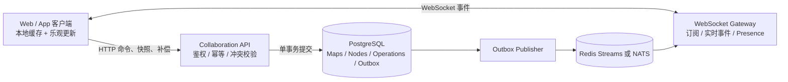

# 长期协作底座设计与实施清单

> 状态：实施中（P1–P3 已验收；P4 双写观察期已开始，`rooms.nodes` JSON 仍是权威数据）  
> 适用项目：`mind-map`  
> 目标：把当前“小图 Yjs、大图 HTTP”的双一致性模型，逐步升级为统一、可恢复、可审计、可横向扩展的长期协作底座。

## 一、最终目标

- [ ] 所有思维导图使用同一套协作语义，节点数量只影响加载和渲染策略。
- [ ] PostgreSQL 是权威数据源，客户端和 WebSocket 服务都不是最终真相来源。
- [ ] 每个房间拥有严格递增的 `version bigint`，不再使用 `updated_at` 判断协作版本。
- [ ] 所有增删改移动都表示为明确的操作，不再通过上传整棵树推断变化。
- [ ] WebSocket 用于低延迟事件通知，HTTP 用于命令提交、快照、补偿和懒加载。
- [ ] WebSocket 消息丢失或客户端离线后，可以从操作日志精确补齐。
- [ ] 支持大图懒加载，同时保证未加载分支不会永久漏掉变化。
- [ ] 支持幂等提交、多人冲突处理、用户级撤销、历史审计和故障恢复。
- [ ] 支持多实例部署，不依赖单个 Node.js 进程内存状态。

## 二、核心设计原则

1. **版本号是可靠性基础**：每个成功事务只产生一个连续版本。
2. **操作日志是恢复基础**：客户端可以通过 `afterVersion` 补齐缺失事件。
3. **WebSocket 只是加速器**：通知丢失不能造成永久数据不一致。
4. **加载策略不改变协作语义**：100 个节点和 10 万个节点使用相同操作协议。
5. **服务端权威裁决结构冲突**：移动、删除、排序和防环必须在服务端校验。
6. **命令必须幂等**：客户端重试同一个 `operationId` 不得重复修改数据。
7. **撤销也是新操作**：不能用客户端旧快照覆盖其他协作者的修改。
8. **在线状态与文档事件分离**：presence 是瞬时状态，operations 是可靠数据。

## 三、目标整体架构



### 组件职责

#### 客户端

- 保存 `lastAppliedVersion`、已加载节点和待确认的本地操作。
- 对操作执行乐观更新，并在服务端拒绝时回滚对应操作。
- 严格按版本顺序应用服务端事件。
- 发现版本缺口时暂停实时应用，先通过 HTTP 补偿。
- 未加载分支只记录 dirty/version，展开时再获取最新子树。

#### Collaboration API

- 处理鉴权、权限、参数校验、幂等和房间级串行事务。
- 将客户端命令转换为权威事件。
- 同一事务内更新节点、递增房间版本、写操作日志和 outbox。
- 处理结构冲突、防环、父节点删除和 SOP 保护规则。

#### WebSocket Gateway

- 订阅房间事件并低延迟推送给客户端。
- 接受客户端 `subscribe(mapId, afterVersion)`。
- 只负责连接和分发，不直接成为文档权威状态。
- presence 使用独立频道和 TTL，不混入可靠操作日志。

#### PostgreSQL

- 保存规范化节点、房间版本、操作日志和待发布事件。
- 保证每个房间的操作顺序和事务原子性。
- 支持快照、历史审计、补偿查询和恢复。

#### Redis Streams / NATS

- 将已提交事件分发给多个 WebSocket 实例。
- 不替代 PostgreSQL 操作日志。
- 第一阶段可以暂不引入，单实例稳定后再接入。

## 四、目标数据模型

### `maps`

```sql
create table maps (
  id text primary key,
  title text not null,
  version bigint not null default 0,
  root_node_id text,
  created_by text,
  created_at timestamptz not null default now(),
  updated_at timestamptz not null default now()
);
```

### `nodes`

```sql
create table nodes (
  map_id text not null references maps(id),
  id text not null,
  parent_id text,
  position text not null,
  data jsonb not null default '{}'::jsonb,
  node_version bigint not null default 0,
  deleted_at timestamptz,
  created_at timestamptz not null default now(),
  updated_at timestamptz not null default now(),
  primary key (map_id, id)
);

create index nodes_parent_position_idx
  on nodes(map_id, parent_id, position)
  where deleted_at is null;
```

### `operations`

```sql
create table operations (
  map_id text not null references maps(id),
  version bigint not null,
  operation_id uuid not null,
  actor_id text not null,
  client_id text,
  operation_type text not null,
  payload jsonb not null,
  event jsonb not null,
  inverse_payload jsonb,
  created_at timestamptz not null default now(),
  primary key (map_id, version),
  unique (map_id, operation_id)
);
```

### `outbox`

```sql
create table outbox (
  id bigserial primary key,
  map_id text not null,
  version bigint not null,
  event jsonb not null,
  created_at timestamptz not null default now(),
  published_at timestamptz,
  unique (map_id, version)
);
```

### 数据约束待办

- [ ] 为每个节点保留稳定 UID，禁止复用已删除节点 UID。
- [x] 明确根节点约束：每个房间只能有一个有效根节点。
- [ ] 防止节点把自己或自己的后代设为父节点。
- [ ] 明确软删除保留周期和永久清理策略。
- [ ] 为 `operations` 制定保留、归档和快照压缩策略。
- [ ] 确认 `data jsonb` 中哪些字段需要拆成独立列或字段版本。

## 五、统一操作协议

### 客户端命令格式

```json
{
  "operationId": "55d33c1d-a8ed-4e10-8ed0-c028dd21421f",
  "mapId": "room-123",
  "actorId": "user-456",
  "clientId": "browser-tab-789",
  "baseVersion": 1082,
  "type": "node.insert",
  "payload": {
    "uid": "node-new",
    "parentUid": "node-parent",
    "position": "aM",
    "data": {
      "text": "新节点"
    }
  }
}
```

### 第一批操作类型

- [x] `node.insert`
- [x] `node.update`
- [x] `node.move`
- [x] `node.delete`
- [ ] `node.restore`
- [ ] `node.reorder`
- [x] `map.update`
- [x] `batch.apply`
- [ ] `operation.undo`
- [ ] `operation.redo`

### 服务端事件格式

```json
{
  "mapId": "room-123",
  "version": 1083,
  "operationId": "55d33c1d-a8ed-4e10-8ed0-c028dd21421f",
  "actorId": "user-456",
  "type": "node.inserted",
  "payload": {
    "uid": "node-new",
    "parentUid": "node-parent",
    "position": "aM",
    "data": {
      "text": "新节点"
    }
  },
  "affectedUids": ["node-new", "node-parent"]
}
```

### 服务端提交事务

- [x] 根据 `(map_id, operation_id)` 检查是否已处理。
- [x] 使用数据库事务锁定对应 `maps` 行。
- [x] 读取当前 `maps.version`，执行权限和冲突校验。
- [ ] 修改 `nodes`。
- [x] 将 `maps.version` 增加 1。
- [x] 写入 `operations`，包括权威事件和逆向操作数据。
- [ ] 写入相同版本的 `outbox`。
- [ ] 提交事务后再进行消息发布。
- [x] 重复提交返回第一次的结果，不重复产生版本。

## 六、客户端同步状态机

```text
BOOTSTRAP
  └─ 获取快照和 snapshotVersion

CONNECTING
  └─ WebSocket subscribe(afterVersion)

LIVE
  ├─ 收到 version = last + 1：直接应用
  ├─ 收到 version <= last：忽略重复事件
  └─ 收到 version > last + 1：进入 RECOVERING

RECOVERING
  ├─ GET /operations?after=last
  ├─ 顺序补齐事件
  └─ 补齐后返回 LIVE

RESNAPSHOT
  └─ 日志已归档或差距过大时重新加载快照
```

### 客户端实现待办

- [ ] 增加统一 `collaborationStore`，保存连接和版本状态。
- [x] 保存 `lastAppliedVersion`。
- [ ] 保存 `pendingOperations`，以 `operationId` 为键。
- [ ] 将画布命令转换成协议操作，不再直接上传完整树。
- [ ] 实现乐观更新确认、拒绝回滚和超时重试。
- [ ] 实现严格顺序事件缓冲区。
- [x] 实现缺口检测和 HTTP 补偿。
- [x] 实现重复事件去重。
- [x] 实现快照过期后的无损重载。
- [x] 编辑中的文本节点收到远端更新时避免打断输入。

## 七、大图懒加载

### 快照接口

```http
GET /api/maps/{mapId}/snapshot?depth=2
```

响应必须包含：

- 当前 `version`
- 根节点和指定深度节点
- 每个返回节点的 `childCount`
- 子树版本或最后影响版本
- 是否截断及继续加载信息

### 子树接口

```http
GET /api/maps/{mapId}/subtrees/{uid}?depth=2&knownVersion=91
```

### 懒加载待办

- [ ] 客户端维护 `loadedUids`。
- [ ] 客户端维护 `dirtySubtrees: uid -> version`。
- [ ] 远端事件影响未加载节点时，只标记对应祖先分支 dirty。
- [ ] 展开节点时获取最新子树，并以服务端版本合并。
- [ ] 删除未加载子树时更新父节点 `childCount`。
- [ ] 移动节点跨越已加载和未加载分支时正确刷新两侧父节点。
- [x] 搜索和定位接口返回祖先链，客户端按链逐层加载。
- [x] 导出走服务端完整快照，不依赖客户端已加载范围。

## 八、冲突处理规则

### 结构冲突

- [x] 插入时父节点不存在：返回明确错误，不静默丢失。
- [ ] 父节点已删除：根据产品规则选择拒绝或挂到最近有效祖先。
- [x] 移动形成环：服务端拒绝。
- [x] 两人同时移动同一节点：按服务端提交顺序生效并保留历史。
- [ ] 删除与移动同时发生：删除优先，移动返回冲突。
- [ ] 删除与编辑同时发生：删除优先，编辑进入可恢复的失败状态。
- [x] SOP 等受保护节点继续在服务端进行权限确认。

### 属性冲突

- [ ] 普通字段采用字段级版本或明确的最后写入生效规则。
- [ ] 事件中携带被修改的字段，不用整份 `data` 覆盖其他字段。
- [ ] 图片、标签、备注、样式分别定义合并策略。
- [ ] 确定富文本是否需要节点级 CRDT。

### 文本协作建议

- [x] 第一阶段使用节点文本提交操作，编辑完成或节流后提交。
- [ ] 如果确实需要逐字符共同编辑，为单个活跃节点建立小型 Y.Doc。
- [ ] 树结构、移动、删除和排序始终走服务端操作日志。
- [x] 禁止再让整个大型思维导图共享一个无限增长的 Y.Doc。

## 九、节点排序策略

- [ ] 使用 Fractional Indexing、LexoRank 或等价位置键替代数组下标。
- [ ] 同位置并发插入时使用 `position + actorId/operationId` 稳定排序。
- [ ] 服务端返回最终权威 `position`。
- [ ] 客户端不能自行假设服务器接受了原位置。
- [ ] 位置键过长时后台执行 `reindex`，并广播批量重排事件。
- [ ] 为批量重排设计不阻塞普通编辑的策略。

## 十、撤销与重做

- [x] 每个可撤销操作保存 `inverse_payload`。
- [ ] 撤销只针对当前用户自己的已提交操作。
- [ ] 撤销通过提交新操作完成，不能恢复整棵旧树。
- [ ] 被后续操作影响时，服务端判断逆向操作是否仍可安全执行。
- [ ] 无法直接撤销时返回冲突原因和可选恢复方案。
- [ ] 客户端撤销栈保存 `operationId`，不保存全量树 JSON。

## 十一、Presence 与实时事件

### Presence

- [ ] 独立频道：`presence:{mapId}`。
- [ ] 使用 `clientId` 区分同一用户的不同标签页和设备。
- [ ] 状态包含用户、光标、选中节点和编辑节点。
- [ ] Redis TTL 建议 30 秒，客户端每 10 秒续期。
- [x] 离线状态不写入操作日志。

### 文档事件

- [ ] 独立频道：`events:{mapId}`。
- [ ] 所有事件必须包含连续 `version`。
- [ ] WebSocket 只广播数据库已提交事件。
- [ ] 客户端不得将 awareness 消息视为可靠文档事件。
- [ ] 广播失败由 outbox 重试，不影响数据库事务结果。

## 十二、多实例和可靠发布

- [ ] 引入 Transactional Outbox。
- [ ] 实现 outbox 后台发布器。
- [ ] 为 outbox 记录重试次数、错误和发布时间。
- [ ] 引入 Redis Streams 或 NATS 作为跨实例事件总线。
- [ ] WebSocket 实例按房间订阅总线事件。
- [ ] 发布器和消费者都必须支持重复消息。
- [ ] 验证 API 实例重启不会丢失已提交事件。
- [ ] 验证 WebSocket 实例扩缩容不会打乱房间版本顺序。
- [ ] 为失败 outbox 提供监控和人工重放工具。

## 十三、建议 API

```text
POST   /api/maps/{mapId}/operations
POST   /api/maps/{mapId}/operations/batch
POST   /api/maps/{mapId}/operations/{operationId}/undo

GET    /api/maps/{mapId}/snapshot
GET    /api/maps/{mapId}/operations?after={version}
GET    /api/maps/{mapId}/nodes?uids={uids}
GET    /api/maps/{mapId}/subtrees/{uid}
GET    /api/maps/{mapId}/locate/{uid}
GET    /api/maps/{mapId}/version

WS     /collaboration
```

### WebSocket 消息

```json
{
  "type": "subscribe",
  "mapId": "room-123",
  "afterVersion": 1083
}
```

```json
{
  "type": "event",
  "mapId": "room-123",
  "version": 1084,
  "event": {}
}
```

```json
{
  "type": "resnapshot_required",
  "mapId": "room-123",
  "currentVersion": 9000
}
```

## 十四、分阶段实施计划

### P0：固定现状和建立基线

- [x] 为当前小图 Yjs 和大图 HTTP 流程补充架构说明。
- [x] 记录当前 100、1,000、10,000 节点的加载和编辑指标。
- [x] 增加双客户端浏览器端到端协作测试。
- [ ] 增加断网、重连、重复请求和服务重启测试。
- [x] 确认当前 PostgreSQL 数据备份和恢复流程。

验收标准：现有行为有自动化测试保护，后续迁移可以判断是否回归。

#### 当前实现（2026-09）

权威数据仍是 PostgreSQL `rooms.nodes` JSON，另有 `rooms.version` 与 `room_operations`。客户端和内存中的 Y.Doc 都不是最终真相。

协作仍是双路径，阈值在 `mindDoc.HTTP_COLLAB_AT` / `LARGE_MAP_AT`（200 节点）：

| 规模 | 写路径 | 版本 / 操作日志 | 实时通道 |
|---|---|---|---|
| 小图（<200） | Yjs WebSocket 直接改 live Y.Doc，定时写入 `rooms.nodes` | 不走操作日志，通常也不递增 `version` | Yjs 同步整图 |
| 大图（≥200） | HTTP 节点/操作 API：先在临时 Y.Doc 上应用，提交数据库后再合并 live | 每次成功事务 `version+1` 并写入 `room_operations` | WebSocket awareness 只作通知；缺口用 `GET /operations?after=` 补偿 |

HTTP 节点增删改、SOP 批处理、整图替换、房间重命名（`map.update`）已接到操作服务。小图 CRDT 保存仍绕过该路径，因此“所有节点修改递增版本”目前只覆盖 HTTP 写路径。

P1–P3 自动化验收（`npm run test:collab:operations`，需本机 collab `http://127.0.0.1:1234`）：

- 连续 1,000 次插入，版本从 0 严格到 1000，`/operations` 分页无重复、无倒退。
- 同一 `operationId` 重复 10 次只产生 version=1。
- 两个内存副本随机丢弃约 10% 通知后，按 `lastAppliedVersion` 暂停乱序应用，再 `GET /operations?after=` 顺序补齐，结构与服务端一致。

双浏览器 Chromium E2E 仍未覆盖；已有两个真实 WebSocket 会话模拟两个标签页：一方 HTTP 写入并通过 awareness `documentChange` 通知，另一方按版本补偿，断线重连后仍收敛。重复 `operationId` 已覆盖。服务进程重启仍未覆盖。

#### 预览指标基线（本机 `buildPreview`，2026-09-01）

仅测量服务端从对象图生成预览树的 CPU 时间，不含网络、浏览器渲染和首次打开整页：

| 节点数 | `buildPreview` |
|---|---|
| 100 | 0.45ms |
| 1,000 | 1.79ms |
| 10,000 | 3.06ms |

10,000 节点预览会走折叠/裁剪（`keepDepth=2`），不把整图交给客户端。完整加载/编辑 P95 仍待浏览器侧补测。

#### PostgreSQL 备份与恢复

Docker Compose 中的 Postgres 数据卷为 `mind-map-pg`，主机端口 `127.0.0.1:${PGPORT:-15432}`，库名默认 `mind_map`，用户默认 `postgres`。

备份（容器内）：

```bash
docker compose exec postgres pg_dump -U postgres -d mind_map > mind_map_backup.sql
```

从主机连接时使用 `127.0.0.1:15432`。恢复前应停止写入（停 app / 本机 `collabServer`），避免本地 collab 与 Docker 共用同一库时两边同时改数据。恢复示例：

```bash
docker compose exec -T postgres psql -U postgres -d mind_map < mind_map_backup.sql
```

本机调试用的 `node ./bin/collabServer.js` 与 Docker Postgres 共用该库；跑完集成测试后应关掉本机 1234 端口进程，避免和容器内服务抢同一份 `rooms` 数据。

### P1：引入房间单调版本号

- [x] 为 `rooms/maps` 增加 `version bigint not null default 0`。
- [x] 所有节点修改在事务内递增版本。
- [x] API 响应和 WebSocket 通知返回 `version`。
- [x] 客户端保存 `lastAppliedVersion`。
- [x] 保留当前 `updated_at`，但停止将其用于一致性判断。

验收标准：连续快速执行 1,000 次操作，版本严格从 N 增长到 N+1000，无重复、无倒退。

### P2：建立操作日志和幂等命令

- [x] 创建 `operations` 表。
- [x] 实现 `operationId` 幂等。
- [x] 将新增、修改、移动、删除转换成统一操作协议。
- [x] 操作日志记录 actor、payload、event 和 inverse payload。
- [x] 旧 HTTP 节点接口内部适配到新操作服务，避免立即改完所有前端。

验收标准：同一请求重复 10 次只产生一次数据修改和一个版本。

### P3：可靠断线补偿

- [x] 实现 `/operations?after=`。
- [x] 客户端检测版本缺口。
- [x] 缺口发生时暂停后续事件并顺序补齐。
- [x] 操作日志不可用或差距过大时要求重新加载快照。
- [x] 删除大图模式对 `save-status.updated_at` 的同步依赖。

验收标准：随机丢弃 10% WebSocket 消息后，两个客户端仍最终收敛到相同版本和结构。

### P4：规范化节点存储

- [x] 创建 `nodes` 表和索引。
- [x] 编写旧 `rooms.nodes` JSON 到规范化表的迁移程序。
- [x] 迁移过程支持校验节点数、根节点、父子关系和环。
- [x] 读取接口优先使用 `nodes` 表。
- [x] 保留旧快照双写一段观察期。
- [ ] 通过校验后停止旧 JSON 作为权威数据源。

验收标准：迁移前后导出的完整树结构和节点数据一致。

当前表名随现有 schema：`room_nodes(room_key, uid)`，尚未改名为目标文档中的 `maps` / `nodes`。`position` 暂为 8 位零填充下标，P9 再换成 Fractional Indexing。写入 `rooms.nodes` JSON 的同一事务内双写 `room_nodes`；读路径在行数、版本和结构与 JSON 一致时优先用表，否则回退 JSON。可用 `COLLAB_NODES_DUAL_WRITE=0` / `COLLAB_NODES_READ=0` 关闭双写或读优先。观察期结束前不要停止写 JSON。

### P5：统一小图和大图协作语义

- [ ] 小图也改用操作事件协议同步结构。
- [ ] 移除“200 节点后改变一致性模型”的逻辑。
- [ ] 阈值仅用于选择全量加载或懒加载。
- [ ] 评估是否保留节点级 Yjs 文本协作。
- [ ] 删除不再需要的整图 Yjs 同步和双路径代码。

验收标准：同一房间节点从 199 增长到 201 时无需重连或切换协作协议。

### P6：大图懒加载完善

- [ ] 实现 snapshot/subtree/locate 的统一版本语义。
- [ ] 实现 dirty subtree 标记。
- [ ] 实现跨已加载与未加载分支的移动。
- [ ] 搜索、导航和导出不依赖客户端完整树。
- [ ] 验证 10 万节点房间的首次加载和常规编辑性能。

验收标准：首次只加载有限节点，任何分支展开后都能获取截至当前版本的正确内容。

### P7：Outbox 和多实例

- [ ] 创建 `outbox` 表。
- [ ] 事务内同时写 operations 和 outbox。
- [ ] 接入 Redis Streams 或 NATS。
- [ ] 部署至少两个 API 实例和两个 WebSocket 实例验证。
- [ ] 加入发布失败重试、积压监控和重放工具。

验收标准：任意实例重启、断线或扩容后不丢已提交操作。

### P8：撤销、审计和历史能力

- [ ] 用户级逆向操作撤销。
- [ ] 操作历史查询界面。
- [ ] 指定版本快照生成。
- [ ] 操作日志归档和定期快照。
- [ ] 管理员审计和故障恢复工具。

验收标准：撤销不会覆盖其他用户之后提交的无关修改，并能追踪每次变更来源。

## 十五、测试矩阵

### 正确性

- [ ] 两个用户同时新增同一父节点的子节点。
- [ ] 两个用户同时编辑同一节点不同字段。
- [ ] 同一节点同时移动和删除。
- [ ] 同时移动两个节点且可能形成环。
- [x] 重复提交相同 `operationId`。
- [ ] WebSocket 事件重复、乱序和丢失。
- [x] 客户端离线一段时间后恢复。
- [ ] API 提交成功但 WebSocket 广播失败。
- [ ] 同一用户多标签页协作。

### 大图

- [ ] 1,000、10,000、100,000 节点首次打开。
- [ ] 未加载分支发生新增、删除和移动。
- [ ] 展开 dirty 分支。
- [ ] 大图搜索、定位、导出和撤销。
- [ ] 连续批量粘贴和批量删除。

### 故障

- [ ] API 实例在事务提交前退出。
- [ ] API 实例在事务提交后、事件发布前退出。
- [ ] Outbox 发布器退出和恢复。
- [ ] Redis/NATS 暂时不可用。
- [ ] PostgreSQL 主连接短暂中断。
- [ ] WebSocket 实例重启。

### 性能目标待确认

- [ ] 普通操作 API P95 小于 150ms。
- [ ] 正常网络下远端可见 P95 小于 500ms。
- [ ] 断线恢复 1,000 个操作小于 3 秒。
- [ ] 10 万节点首次预览不下载整图。
- [ ] 单房间高频操作不会阻塞其他房间。

## 十六、监控与运维

- [ ] 指标：每房间当前版本、操作速率和失败率。
- [ ] 指标：WebSocket 连接数、广播延迟和重连次数。
- [ ] 指标：版本缺口恢复次数和重新快照次数。
- [ ] 指标：outbox 积压数量、最老积压时间和失败次数。
- [ ] 指标：操作 API P50/P95/P99。
- [ ] 日志统一包含 `mapId`、`operationId`、`version`、`actorId`。
- [ ] 对版本不连续、重复版本和非法结构建立告警。
- [ ] 提供房间一致性检查工具。
- [ ] 提供按房间暂停写入、导出和修复工具。

## 十七、安全要求

- [x] HTTP 和 WebSocket 使用同一身份认证来源。
- [x] 订阅房间前验证读取权限。
- [x] 提交操作前验证编辑权限。
- [x] 服务端验证节点确实属于目标房间。
- [ ] 限制单操作体积、批量操作数量和请求频率。
- [x] 防止客户端伪造 actorId，以鉴权身份为准。
- [ ] operation/event 日志不得保存不必要的敏感信息。
- [x] SOP 和受保护区域规则只能由服务端决定。

## 十八、当前代码迁移映射

| 当前模块 | 当前职责 | 目标变化 |
|---|---|---|
| `simple-mind-map/bin/mindApi.js` | HTTP 文件和节点接口 | 拆出 operation service，旧接口作为适配层 |
| `simple-mind-map/bin/storage.js` | 房间快照、保存状态、PG/COS | 迁移为 maps/nodes/operations/outbox 持久化 |
| `simple-mind-map/bin/collabServer.js` | Yjs WebSocket 服务 | 演进为事件订阅网关，presence 独立 |
| `simple-mind-map/src/plugins/Cooperate.js` | Yjs 与 HTTP 双模式客户端 | 改为统一版本状态机和操作应用器 |
| `web/src/pages/Edit/components/CooperateDialog.vue` | 加入房间、provider、轮询 | 只管理会话与在线成员，协作状态下沉到 store |
| `web/src/utils/fileApi.js` | 文件和节点 HTTP API | 增加 operations/snapshot/recovery API |

## 十九、迁移和回滚策略

- [ ] 每一阶段由 feature flag 控制，例如 `COLLAB_PROTOCOL_V2`。
- [ ] 先对测试房间启用，再对新建房间启用，最后迁移存量房间。
- [ ] 规范化存储迁移期间进行新旧格式双写和后台一致性校验。
- [ ] 每个房间记录当前协议版本，禁止同一房间客户端使用不同写协议。
- [ ] 新协议失败时可以停止新写入并回退读取旧快照。
- [ ] 回滚不得通过旧快照覆盖已经提交的新操作。
- [ ] 数据库迁移脚本必须同时提供验证脚本和可控回滚方案。

## 二十、完成定义

长期协作底座只有在以下条件全部满足后才能视为完成：

- [ ] 小图和大图使用同一操作与版本协议。
- [ ] 不依赖页面刷新获得其他用户的修改。
- [ ] WebSocket 丢消息后能够自动补偿。
- [ ] 所有命令幂等，版本严格连续。
- [ ] 未加载分支最终能够获取正确状态。
- [ ] 多实例部署不会丢事件或产生不同顺序。
- [ ] 撤销不会覆盖其他用户无关修改。
- [ ] 可以按操作追踪修改人、修改内容和版本。
- [ ] 关键并发、断线、大图和故障场景均有自动化测试。
- [ ] 具备监控、告警、备份、恢复和一致性检查工具。

## 二十一、推荐执行顺序

当前最优先执行：

1. P0 自动化测试基线。
2. P1 `room.version bigint`。✅
3. P2 操作日志和幂等命令。✅
4. P3 断线补偿。✅
5. P4 节点规范化存储。
6. P5 统一协作语义。
7. P6 大图懒加载完善。
8. P7 多实例和可靠发布。
9. P8 撤销、审计和历史能力。

不要先重写 UI，也不要先引入 Redis。第一条主线必须是：**版本号 → 操作日志 → 断线补偿**。这三项完成后，后续懒加载、多实例和历史能力才有可靠基础。

P1–P3 已在现有 `rooms` / `room_operations` 上落地，旧 HTTP 节点接口作为适配层，大图客户端按 `lastAppliedVersion` 做 HTTP 补偿。权威数据仍是 `rooms.nodes` JSON，P4 规范化节点表尚未开始。

P1 的 1000 次连续版本、P2 的 10 次相同 `operationId`、P3 的双副本丢通知后 HTTP 顺序补齐，已由 `test:collab:operations` 覆盖。`map.update`（房间重命名）已写入操作日志且 `resnapshot=false`。下一步是 P4 之前先补双浏览器 E2E；在 1000 次与丢包验收已通过的前提下，P4 可以开始，但仍不要先引入 Redis。
