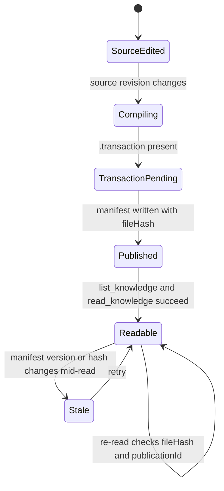

# Hiring SOP

Both Phase 2A test rooms publish the same SOP branch, `branches/hiring-sop.md`, titled
**Hiring SOP · Standard**. The body is identical between rooms except for a unique marker line.

## Body (identical in both rooms)

```
# Hiring SOP · Standard

Steps:
1. Intake resume
2. Screen
3. Interview
```

## Room-specific markers

| Room | Marker | Canonical room page |
| --- | --- | --- |
| `ow-p2a-room-a` | `P2A_MARKER_ow-p2a-room-a` | [rooms/ow-p2a-room-a.md](../rooms/ow-p2a-room-a.md) |
| `ow-p2a-room-b` | `P2A_MARKER_ow-p2a-room-b` | [rooms/ow-p2a-room-b.md](../rooms/ow-p2a-room-b.md) |

## Why the markers exist

This is a contract test: the SOP body is a constant, so the markers are the only content signal
that lets a reader or agent prove which room a document came from. Because the bodies are otherwise
identical, the rooms remain distinguishable only by marker, `roomId`, `sourceHash`, and
`publicationId` — see [sources/canonical.md](../sources/canonical.md).

## Publication lifecycle

How a room's SOP branch becomes readable through the Canonical read-only tools:



State flow from room source edit to a version-checked Canonical read.
