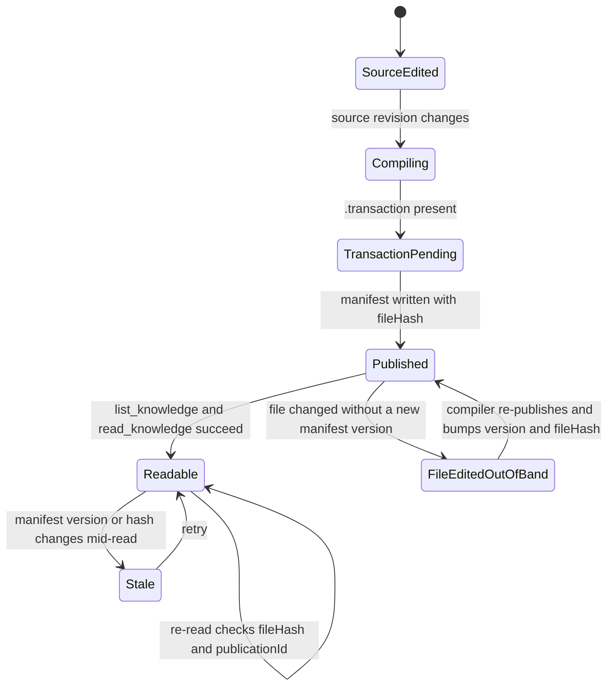

# Hiring SOP

Both Phase 2A test rooms publish the same SOP branch, `branches/hiring-sop.md`, titled
**Hiring SOP · Standard**. At the original publication the body was identical between rooms except
for a unique marker line; after the Phase 2A refresh, room A carries one extra edit marker.

## Shared body (unchanged in both rooms)

```
# Hiring SOP · Standard

Steps:
1. Intake resume
2. Screen
3. Interview
```

## Room-specific content

| Room | Marker | Branch size | Canonical room page |
| --- | --- | --- | --- |
| `ow-p2a-room-a` | `P2A_MARKER_ow-p2a-room-a` + `P2A_EDIT_MARKER_room-a-refresh-test` | 167 bytes on disk | [rooms/ow-p2a-room-a.md](../rooms/ow-p2a-room-a.md) |
| `ow-p2a-room-b` | `P2A_MARKER_ow-p2a-room-b` | 118 bytes | [rooms/ow-p2a-room-b.md](../rooms/ow-p2a-room-b.md) |

Room A's appended section, after the original body:

```
Unique marker: P2A_MARKER_ow-p2a-room-a

## Phase2A edit
P2A_EDIT_MARKER_room-a-refresh-test
```

## Why the markers exist

This is a contract test: the SOP body is a constant, so the markers are the only content signal
that lets a reader or agent prove which room a document came from. While the bodies were byte-equal
apart from one marker line, the rooms were distinguishable only by marker, `roomId`, `sourceHash`,
and `publicationId` — see [sources/canonical.md](../sources/canonical.md). The `room-a-refresh-test`
marker is the first case where the two room copies **differ in size**, so it also demonstrates that
an edit can appear in the room directory without a matching manifest version bump.

## Publication lifecycle

How a room's SOP branch becomes readable through the Canonical read-only tools:



State flow from room source edit to a version-checked Canonical read. Room A is currently in the
`FileEditedOutOfBand` state, where the on-disk file no longer matches the published `fileHash`.
