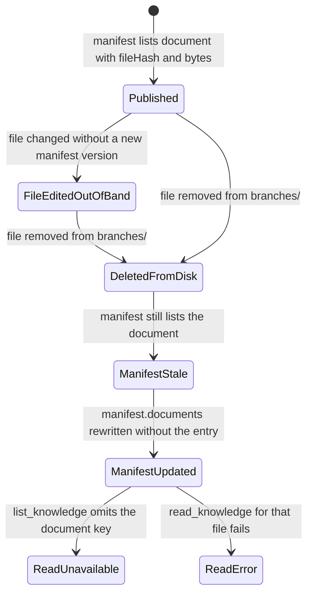

# Test Room ow-p2a-room-a

**Room label:** Phase2A Test Room ow-p2a-room-a
**Topic:** Hiring SOP overview
**Source:** Canonical publication surface — see [sources/canonical.md](../sources/canonical.md)

## Current state (Phase2A delete test)

`branches/hiring-sop.md` has been **deleted** from this room. It was removed from disk and from
`manifest.documents`, and the `branches/` directory is now empty. `README.md` is therefore the room's
only published document, and the SOP body documented in [topics/hiring-sop.md](../topics/hiring-sop.md)
is **no longer available from room A** — room B remains the only surviving copy.

## README.md (verbatim summary)

> `# Phase2A Test Room ow-p2a-room-a`
>
> This is an isolated OpenWiki Output Contract test room.
> Topic: Hiring SOP overview.

- 123 bytes, sha256 `2ab37b56961284ba2206253eb0566b4d53b331e0797eacb69d56c0877be8cdd1` — unchanged by the
  deletion and matching `manifest.documents["README.md"].fileHash`.

## Publication metadata

`manifest.json` was rewritten at 2026-09-18T04:11:01Z (manifest mtime), after the file was removed:

- `version` 1, `lastCompiledVersion` 1, `syncVersion` 1, `publicationId` `de4595f0-a8aa-4ab0-b51c-44ae2919dfbf`
- `sourceUpdatedAt` 2026-09-18T04:01:04.1124944Z, `lastCompiledAt` 2026-09-18T04:01:04.1155023Z
- `sourceHash` `2ab37b56961284ba2206253eb0566b4d53b331e0797eacb69d56c0877be8cdd1` — now identical to the
  README hash, which previously differed from it
- `documents` contains only `README.md`; the `branches/hiring-sop.md` entry (118 bytes, `fileHash`
  `9ebb50c5bcb4cf30b45611bfd43cdf23ba0e8eddff8a7eda89db0e38e5b472d6`) is gone

## History of this room's branch

The branch changed twice within the Phase 2A test runs, and both changes left the version counters at 1:

1. **Published (version 1):** `branches/hiring-sop.md` was 118 bytes with `fileHash`
   `9ebb50c5bcb4cf30b45611bfd43cdf23ba0e8eddff8a7eda89db0e38e5b472d6`, carrying the marker
   `P2A_MARKER_ow-p2a-room-a`.
2. **Edited out of band:** the file was modified on disk at 2026-09-18T04:09:47Z, growing to 167 bytes
   (sha256 `e171bcb6397e8d3ab0ab23af68ab512e97e22fdea71fab13b01dc16702cf729c`) with the extra marker
   `P2A_EDIT_MARKER_room-a-refresh-test` under a `## Phase2A edit` heading. `manifest.documents` was
   **not** updated, so the file and its recorded `fileHash` disagreed.
3. **Deleted:** the file was removed at 2026-09-18T04:10Z and the manifest was rewritten without the
   document entry. This deletion test therefore removed the divergence rather than resolving it: the
   out-of-band edit was never published, and `version` never advanced past 1.

Because neither the edit nor the deletion bumped `version`, `publicationId`, `lastCompiledVersion`, or
`sourceHash` at the moment they occurred, `version` alone does **not** indicate the state of this room's
documents. Only the `documents` map does.

## Deletion lifecycle

How a room document moves from published to deleted, per the states observed in this room:

Room A moved from `Published` through `FileEditedOutOfBand` to `DeletedFromDisk` and
`ManifestUpdated`; `README.md` remained `Published` throughout.

## Related

- [topics/hiring-sop.md](../topics/hiring-sop.md) — the SOP content and which room still publishes it.
- [rooms/ow-p2a-room-b.md](ow-p2a-room-b.md) — the room that still keeps the branch.
