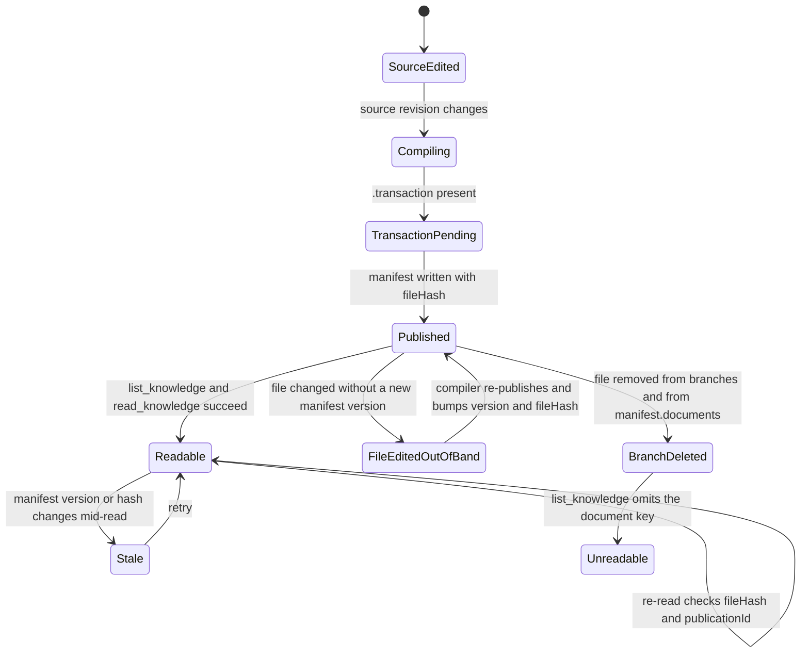

# Hiring SOP

Both Phase 2A test rooms originally published the same SOP branch, `branches/hiring-sop.md`, titled
**Hiring SOP · Standard**. The body was identical between rooms except for a unique marker line, and
room A briefly carried an extra edit marker. As of the Phase2A delete test,
[ow-p2a-room-a](../rooms/ow-p2a-room-a.md) no longer publishes this branch at all, so
[ow-p2a-room-b](../rooms/ow-p2a-room-b.md) is the only room that still serves the SOP.

## Shared body (unchanged in both rooms)

```
# Hiring SOP · Standard

Steps:
1. Intake resume
2. Screen
3. Interview
```

## Which rooms publish it now

| Room | Branch present | Marker | Canonical room page |
| --- | --- | --- | --- |
| `ow-p2a-room-a` | **No** — deleted from disk and from `manifest.documents` | none (branch removed) | [rooms/ow-p2a-room-a.md](../rooms/ow-p2a-room-a.md) |
| `ow-p2a-room-b` | Yes, 118 bytes, `fileHash` `de49362fc633736df95207a79733b2fa5921a98069d19c11fffeafadc01afed1` | `P2A_MARKER_ow-p2a-room-b` | [rooms/ow-p2a-room-b.md](../rooms/ow-p2a-room-b.md) |

Room B's full document body:

```
Unique marker: P2A_MARKER_ow-p2a-room-b
```

(appended after the shared body above). Room B's manifest `fileHash` still matches the file on disk.

## Deleted copy in room A

Room A's branch went through three states inside the same Phase 2A run, all without a version bump:

1. Published at 118 bytes with marker `P2A_MARKER_ow-p2a-room-a`.
2. Edited out of band at 2026-09-18T04:09:47Z to 167 bytes, adding the marker
   `P2A_EDIT_MARKER_room-a-refresh-test` under a `## Phase2A edit` heading; `manifest.documents` was
   never updated for this edit.
3. Deleted at 2026-09-18T04:10Z; `branches/` is now empty and `manifest.documents` lists only
   `README.md`.

So the room A branch content — including both the shared body and the
`P2A_EDIT_MARKER_room-a-refresh-test` marker — is **no longer readable** from Canonical. It is recorded
here only as history; see [sources/canonical.md](../sources/canonical.md) and
[rooms/ow-p2a-room-a.md](../rooms/ow-p2a-room-a.md) for the evidence trail.

## Why the markers exist

This is a contract test: the SOP body is a constant, so the markers are the only content signal that
lets a reader or agent prove which room a document came from. While the bodies were byte-equal apart
from one marker line, the rooms were distinguishable only by marker, `roomId`, `sourceHash`, and
`publicationId`. The deletion is the strongest form of the same contract: a room can be proven to have
*dropped* a document by checking `manifest.documents` and the room directory, and the room that no
longer lists the document must not be treated as a source for it.

## Publication lifecycle

How a room's SOP branch becomes readable — and how it stops being readable — through the Canonical
surface:



State flow from room source edit to a version-checked Canonical read. Room A reached the terminal
`Unreadable` state for its SOP branch via `FileEditedOutOfBand` followed by `BranchDeleted`; room B
remains in the steady `Readable` state.

## Related

- [sources/canonical.md](../sources/canonical.md) — the versioning fields and integrity metadata behind
  these claims.
